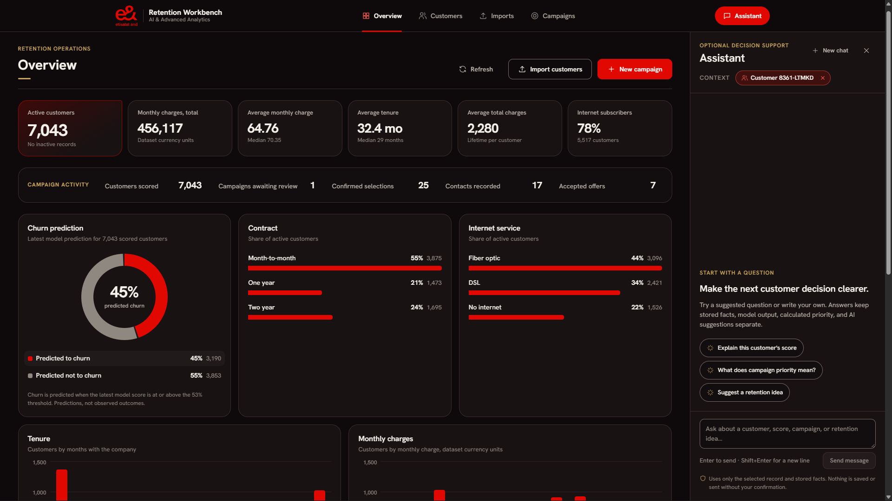

# Retention Campaign Workbench

Churn scores are useful only when they lead to a better conversation with the
right customer. This project turns a telecom churn ML model into a small, local
workspace for doing exactly that: review customer risk, bring in new records,
build a capacity-aware retention campaign, and keep the final decision with a
person.

It is deliberately built as an assistant. The model suggests where to look; it does
not make outreach decisions or claim to predict the future with certainty.

This is a local internship demonstration, not a deployed production service. It has no authentication or real outreach delivery.



## What you can do

- Explore the overview dashboard for customer mix, charges, tenure, and
  model-predicted churn.
- Review customers and their churn-risk history.
- Create or update individual customer records and score them with the bundled
  Random Forest model.
- Import CSV files through a preflight-and-confirm flow, so bad rows can be
  caught before anything is written.
- Build a limited-capacity retention campaign. Customers are ranked using churn
  risk and relative monthly and historical spend; recommendations can be
  reviewed and overridden before confirmation.
- Record simulated contact outcomes for a confirmed campaign, inspect the
  audit history, export the outreach queue, and view an illustrative financial
  estimate based on explicit campaign assumptions.
- Optionally use the assistant side panel for customer lookup and **staged**
  single-customer writes. Every write has a structured preview, confirmation
  token, and idempotency key.

## How it works

```text
Customer record or CSV
        |
        v
Validation + trusted model scoring
        |
        v
Customer review and campaign ranking
        |
        v
Human review, optional override, confirmation
```

The API verifies the bundled model's checksum before loading it, stores
prediction history, and treats confirmed campaign selections as immutable.
Campaign ranking is deterministic: it combines each customer's risk score with
percentile-based monthly and historical spend, making the recommendation easier
to inspect and reproduce.

## Stack

- **Frontend:** React, TypeScript, Vite, TanStack Query
- **API:** FastAPI, SQLAlchemy, Alembic
- **Database:** PostgreSQL 16
- **Model:** scikit-learn Random Forest bundle, served through a validated
  inference layer
- **Local environment:** Docker Compose

## Run it locally

You will need Docker Desktop (or Docker Engine with Compose) and `make`.

1. Create your local settings file:

   ```bash
   cp .env.example .env
   ```

2. In `.env`, replace each `replace-with-a-local-password` value with the same
   private development password.

3. Build and start the services:

   ```bash
   make start
   ```

4. In a second terminal, apply the database migrations:

   ```bash
   make migrate
   ```

5. Open the workbench at <http://127.0.0.1:5173>.

If port 5173 is in use, set `FRONTEND_PORT` to a free port in `.env` and set
`CORS_ORIGIN` to the matching URL (for example, `FRONTEND_PORT=5175` and
`CORS_ORIGIN=http://127.0.0.1:5175`). Open the workbench on that port.

The API health checks are available at
<http://127.0.0.1:8000/health/live> and
<http://127.0.0.1:8000/health/ready>. All service ports are bound to
`127.0.0.1` by default.

To import missing records from the tracked 7,043-row IBM telecom churn CSV after startup, run:

```bash
make seed-demo
```

For a guided walkthrough, see [DEMO.md](DEMO.md). For model evaluation and
limitations, see [MODEL_CARD.md](MODEL_CARD.md).

To stop the services without deleting your local database:

```bash
make stop
```

## Optional chat

The rest of the workbench works without an API key. To enable chat, set
`OPENAI_API_KEY` in `.env` and restart the API. For OpenRouter, also set
`OPENAI_BASE_URL=https://openrouter.ai/api/v1` and choose an OpenRouter model,
for example `OPENAI_MODEL=openai/gpt-4o-mini`. When it is not configured, the
assistant panel explains that it is unavailable; customer, import, and campaign
workflows remain available.

## Tests

Run the full backend, frontend, build, accessibility, and disposable migration
checks with:

```bash
make test
```

For faster checks in an already configured environment:

```bash
pytest -q
npm --prefix frontend test
npm --prefix frontend run build
```

## Project layout

- `backend/` — FastAPI service, database models, migrations, and API tests.
- `frontend/` — React application for customer, import, campaign, and assistant
  workflows. Its components follow atoms, molecules, organisms, templates, and
  pages (see [component structure](frontend/src/components/README.md)).
- `models/` — the trusted, exported Joblib model bundle mounted read-only by
  the API.
- `scripts/seed_demo.py` — optional local demo-data seeder.
- `data/raw/` — source CSV used by the notebooks and demo-data seeder.
- `notebooks/eda.ipynb` — data quality checks and exploratory analysis.
- `notebooks/model_selection.ipynb` — independent model comparison and export
  of a candidate bundle under `models/candidates/`.

Open either notebook from the repository root or the `notebooks/` directory.
Run `eda.ipynb` for the exploratory analysis, then run
`model_selection.ipynb` to reproduce model selection and export a candidate.
Each notebook loads the source CSV independently. Promoting a candidate to the
trusted bundle in `models/` requires a separate review; see
[MODEL_CARD.md](MODEL_CARD.md).
